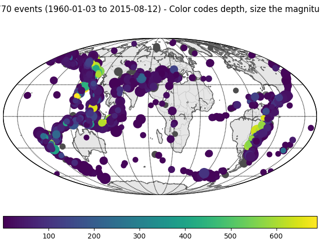
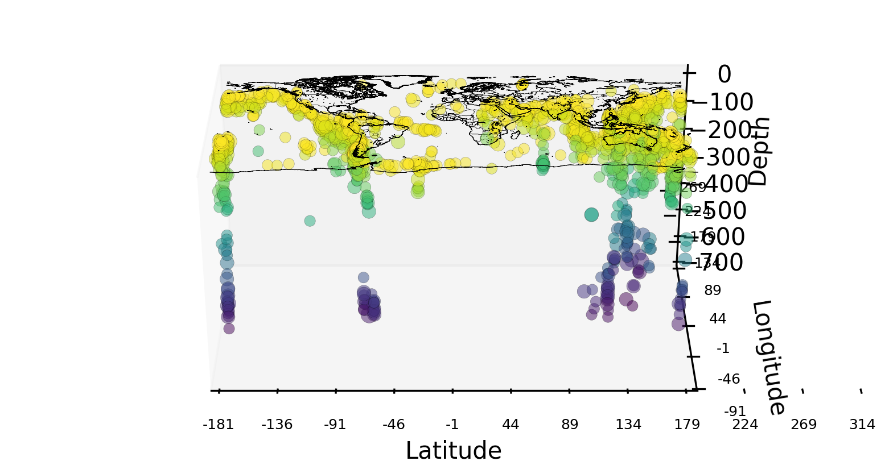

# PlotSeismicity
Plot 3D views of the seismicity

Step 1: select your region of interest (as well as the magnitude requirements).

 

Step 2: run 

Step 3: assemble all the 2D images into a gif (to be implemented)

@earthinversion , we count on you for some further implementations.
